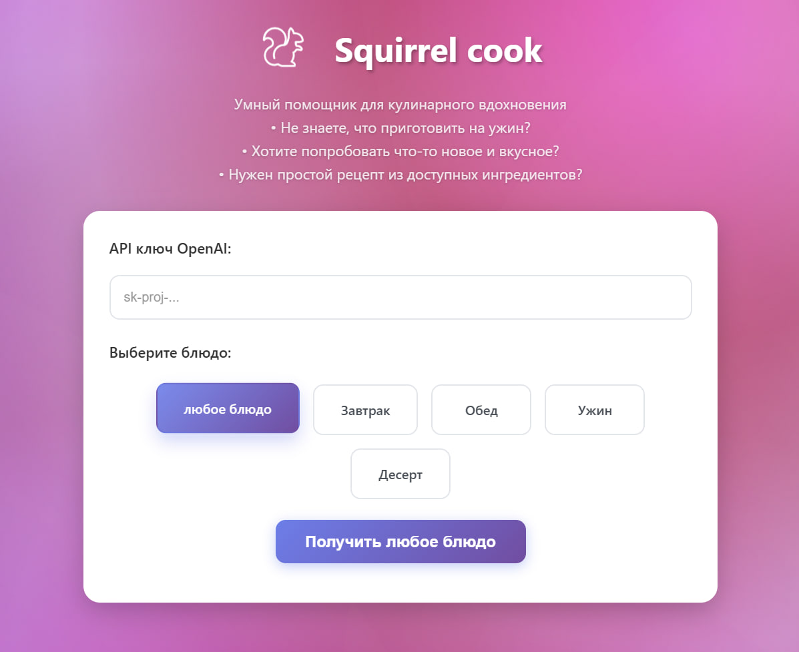
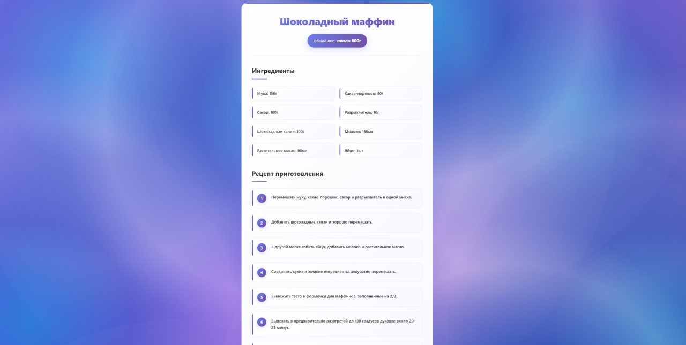
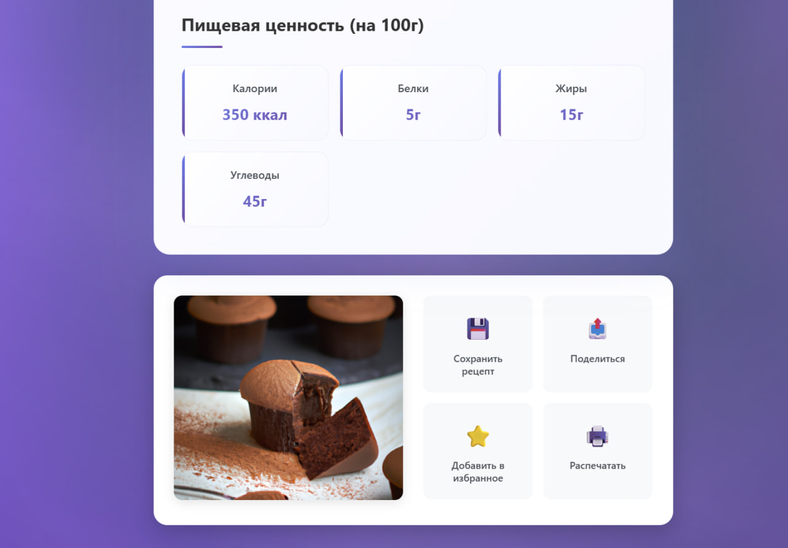

# 🐿️ Squirrel Cook AI

## Кулинарный генератор рецептов и изображений блюд

Squirrel Cook AI — это инновационное веб-приложение, которое использует возможности искусственного интеллекта для создания уникальных рецептов и генерации реалистичных изображений блюд. Проект разработан в качестве практики работы с AI-инструментами и демонстрирует современные подходы к интеграции OpenAI API в веб-приложения. В этом проекте также реализована генерация изображений с помощью DALL-E API, что позволяет визуализировать созданные рецепты.

### ✨ Возможности

- 🍳 **Генерация рецептов**: Создание уникальных кулинарных рецептов на основе ваших предпочтений
- 🖼️ **Генерация изображений**: Визуализация блюд с помощью AI
- 🎨 **Современный интерфейс**: Красивый и интуитивно понятный дизайн
- ⚡ **Быстрая работа**: Оптимизированная архитектура на React + Vite

---

## 📸 Примеры работы


*Генерация рецепта и изображения блюда*


*Результат работы AI-генератора*


*Еще один пример созданного блюда*

---

## 🛠️ Технологический стек

### Frontend
- **React 18** — современная библиотека для создания пользовательских интерфейсов
- **TypeScript** — типизированный JavaScript для надежности кода
- **Vite** — быстрый сборщик и сервер разработки
- **SCSS** — препроцессор для стилизации компонентов

### Backend & API
- **Node.js** — серверная среда выполнения
- **OpenAI API** — интеграция с искусственным интеллектом для генерации контента
- **Express.js** — веб-фреймворк для создания API

### Инструменты разработки
- **ESLint** — линтер для поддержания качества кода
- **Yarn** — менеджер пакетов
- **Git** — система контроля версий

---

## 🚀 Установка и запуск

### Предварительные требования

Убедитесь, что у вас установлены:
- [Node.js](https://nodejs.org/) (версия 16 или выше)
- [Yarn](https://classic.yarnpkg.com/) или npm

### ⚠️ Важно для пользователей из России!

**Обязательно включите VPN** перед использованием приложения. OpenAI API недоступен в России, и без VPN вы получите ошибку "Country, region, or territory not supported".

### Пошаговая инструкция (производственная версия)

1. **Клонируйте репозиторий**
   ```bash
   git clone https://github.com/Stilone/Squirrel-Cook-AI.git
   cd Squirrel-Cook-AI
   ```

2. **Установите зависимости**
   ```bash
   npm install
   ```

3. **Соберите проект**
   ```bash
   npm run build
   ```

4. **Запустите сервер**
   ```bash
   node simple-server.js
   ```
   
   Должно появиться сообщение: "Сервер запущен на http://localhost:3003"

5. **Откройте приложение**
   
   Перейдите в браузере по адресу: [http://localhost:3003](http://localhost:3003)

> 💡 **Примечание:** В этом режиме используется собранная версия приложения из папки `dist`. Сервер обслуживает статические файлы и обрабатывает API-запросы одновременно. **Рекомендуется для конечных пользователей.**

### 🔧 Способ запуска для разработки

**Рекомендуется для разработчиков** - включает hot-reload и автоматическую пересборку при изменениях:

1. **Запустите сервер (в первом терминале)**
   ```bash
   node simple-server.js
   ```

2. **Запустите фронтенд (во втором терминале)**
   ```bash
   yarn run dev
   ```

3. **Откройте приложение**
   
   Перейдите в браузере по адресу: [http://localhost:5173](http://localhost:5173)

> 💡 **Примечание:** В режиме разработки фронтенд работает на порту 5173, а API-запросы отправляются на порт 3003. При изменении кода страница автоматически обновляется.

### 🛠️ Устранение проблем

**Если порт 3003 занят:**
```bash
# Найти процесс, использующий порт
netstat -ano | findstr :3003

# Остановить процесс (замените PID на найденный ID)
taskkill /PID [PID] /F
```

**Если приложение не работает:**
1. Убедитесь, что VPN включен
2. Проверьте, что сервер запущен и показывает сообщение "Сервер запущен"
3. Убедитесь, что у вас есть действующий OpenAI API ключ

---

## 🎯 Как использовать

1. **Настройка API ключа**
   - **Обязательно** добавьте свой OpenAI API ключ для работы приложения
   - Получить ключ можно на [platform.openai.com](https://platform.openai.com/account/api-keys)
   - Без API ключа приложение не сможет генерировать рецепты и изображения

2. **Генерация рецепта**
   - Выберите прием пищи
   - Нажмите кнопку генерации
   - Получите уникальный рецепт с пошаговыми инструкциями

3. **Создание изображения**
   - После генерации рецепта автоматически создается изображение блюда
   - Изображение генерируется с помощью AI на основе описания

---

## 📁 Структура проекта

```
Squirrel-Cook-AI/
├── src/
│   ├── app/           # Основные компоненты приложения
│   ├── features/      # Функциональные модули
│   ├── pages/         # Страницы приложения
│   ├── shared/        # Общие компоненты и утилиты
│   └── widgets/       # Виджеты
├── api/               # API прокси
├── docs/              # Документация и изображения
├── simple-server.js   # Сервер для обработки запросов
└── package.json       # Зависимости проекта
```

---

## 🤝 Благодарности

- [OpenAI](https://openai.com/) за предоставление мощного API
- Сообществу React и Vite за отличные инструменты разработки
- Всем, кто вдохновляет на создание инновационных проектов

---

## 📚 Полезные ссылки

- [OpenAI API Documentation](https://platform.openai.com/docs/api-reference/chat)
- [React Documentation](https://reactjs.org/docs/)
- [Vite Documentation](https://vitejs.dev/guide/)
- [TypeScript Handbook](https://www.typescriptlang.org/docs/)

---

## ⭐ Поддержка проекта

Если проект вам понравился, не забудьте поставить ⭐ звездочку на GitHub! Это поможет проекту стать более заметным и вдохновит на создание новых функций.

**Спасибо за внимание! 🐿️✨**

---

*Проект создан с ❤️ для изучения AI-технологий*

